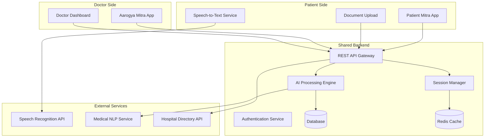
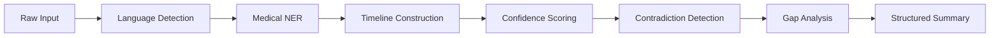

# Design Document: Aarogya Mitra

## Overview

Aarogya Mitra is a dual-application system consisting of Patient_Mitra (intake side) and Aarogya_Mitra (doctor side) that transforms unstructured, multilingual patient information into structured clinical summaries. The system uses AI for information extraction and structuring while maintaining strict boundaries against diagnostic or treatment recommendations.

The architecture follows a client-server model with real-time data synchronization between the two applications through a shared backend. The system prioritizes emergency-room efficiency, multilingual support, and human-in-the-loop medical decision making.

## Architecture

### High-Level Architecture



### Component Architecture

The system is built using a microservices architecture with the following core components:

1. **Frontend Applications**: React-based web applications for both patient and doctor interfaces
2. **API Gateway**: Central routing and authentication point for all requests
3. **AI Processing Engine**: Core service for medical entity extraction and structuring
4. **Session Management**: Real-time data synchronization between applications
5. **Database Layer**: PostgreSQL for persistent storage with Redis for caching
6. **External Integrations**: Speech recognition, medical NLP, and hospital directory services

## Components and Interfaces

### Patient Mitra Application

**Purpose**: Collects and processes raw patient information from attendants or hospital staff.

**Key Components**:
- **Voice Input Handler**: Captures audio and sends to speech-to-text service
- **Text Input Processor**: Handles direct text input with multilingual support
- **Document Upload Manager**: Processes prescription and report uploads
- **Real-time Sync Client**: Maintains connection to backend for live updates

**Interface Specifications**:
```typescript
interface PatientInput {
  sessionId: string;
  inputType: 'voice' | 'text' | 'document';
  content: string | File;
  timestamp: Date;
  language?: string;
}

interface ProcessedInput {
  rawInput: string;
  extractedEntities: MedicalEntity[];
  confidenceScores: ConfidenceTag[];
  detectedLanguages: string[];
}
```

### Aarogya Mitra Application

**Purpose**: Displays structured patient summaries for doctor review and decision making.

**Key Components**:
- **Clinical Summary Viewer**: Structured display of patient information
- **Timeline Visualizer**: Chronological symptom and event display
- **Risk Indicator Panel**: Non-diagnostic flags and alerts
- **Session Selector**: Interface for switching between patient cases

**Interface Specifications**:
```typescript
interface ClinicalSummary {
  sessionId: string;
  patientInfo: PatientBasics;
  symptoms: SymptomTimeline[];
  medicalHistory: MedicalHistory[];
  medications: Medication[];
  riskIndicators: RiskFlag[];
  dataQuality: QualityMetrics;
}

interface SymptomTimeline {
  symptom: string;
  onset: Date;
  duration: string;
  severity: 'mild' | 'moderate' | 'severe';
  confidence: ConfidenceLevel;
}
```

### AI Processing Engine

**Purpose**: Extracts medical entities from unstructured input and generates structured summaries.

**Core Functions**:
- **Medical Entity Extraction**: Identifies symptoms, medications, history, and timeline
- **Multilingual Processing**: Handles mixed-language input and standardizes to English
- **Confidence Assessment**: Assigns reliability scores to extracted information
- **Contradiction Detection**: Identifies conflicting information within input
- **Gap Analysis**: Detects missing critical information

**Processing Pipeline**:


**Interface Specifications**:
```typescript
interface AIProcessingRequest {
  rawInput: string;
  sessionId: string;
  inputType: 'voice' | 'text' | 'document';
  previousContext?: ClinicalSummary;
}

interface AIProcessingResponse {
  extractedEntities: MedicalEntity[];
  timeline: SymptomTimeline[];
  confidenceScores: ConfidenceAssessment;
  contradictions: Contradiction[];
  missingInfo: MissingInfoAlert[];
  riskFlags: RiskIndicator[];
}
```

### Session Management Service

**Purpose**: Maintains real-time data synchronization between Patient_Mitra and Aarogya_Mitra.

**Key Features**:
- **Session Creation**: Generates unique session identifiers
- **Real-time Updates**: WebSocket-based live data synchronization
- **Data Consistency**: Ensures both applications show current information
- **Session Persistence**: Maintains session data for doctor access

**Interface Specifications**:
```typescript
interface SessionManager {
  createSession(): Promise<string>;
  updateSession(sessionId: string, data: Partial<ClinicalSummary>): Promise<void>;
  getSession(sessionId: string): Promise<ClinicalSummary>;
  subscribeToSession(sessionId: string, callback: (data: ClinicalSummary) => void): void;
}
```

## Data Models

### Core Data Structures

**Patient Session**:
```typescript
interface PatientSession {
  sessionId: string;
  createdAt: Date;
  lastUpdated: Date;
  status: 'active' | 'completed' | 'archived';
  patientBasics: PatientBasics;
  clinicalSummary: ClinicalSummary;
  rawInputs: RawInput[];
  processingHistory: ProcessingEvent[];
}
```

**Medical Entity**:
```typescript
interface MedicalEntity {
  id: string;
  type: 'symptom' | 'medication' | 'condition' | 'duration' | 'severity';
  value: string;
  normalizedValue: string;
  confidence: ConfidenceLevel;
  extractedFrom: string;
  timestamp: Date;
}
```

**Confidence Assessment**:
```typescript
interface ConfidenceLevel {
  score: number; // 0.0 to 1.0
  level: 'high' | 'medium' | 'low';
  factors: string[]; // Reasons for confidence level
}
```

**Risk Indicator**:
```typescript
interface RiskIndicator {
  id: string;
  type: 'urgency' | 'complexity' | 'missing_info' | 'contradiction';
  severity: 'low' | 'medium' | 'high';
  description: string;
  basedOn: string[]; // Source symptoms/data
  isAcknowledged: boolean;
}
```

### Database Schema

**Sessions Table**:
- session_id (UUID, Primary Key)
- created_at (Timestamp)
- last_updated (Timestamp)
- status (Enum)
- patient_basics (JSONB)
- clinical_summary (JSONB)

**Raw Inputs Table**:
- input_id (UUID, Primary Key)
- session_id (UUID, Foreign Key)
- input_type (Enum)
- raw_content (Text)
- processed_content (JSONB)
- created_at (Timestamp)

**Medical Entities Table**:
- entity_id (UUID, Primary Key)
- session_id (UUID, Foreign Key)
- entity_type (Enum)
- value (Text)
- normalized_value (Text)
- confidence_score (Float)
- extracted_from (UUID, Foreign Key to Raw Inputs)

## Error Handling

### Error Categories and Responses

**Speech Recognition Errors**:
- **Low Audio Quality**: Request re-recording with guidance
- **Unsupported Language**: Fallback to text input with language detection
- **Service Unavailable**: Queue input for processing when service recovers

**AI Processing Errors**:
- **Entity Extraction Failure**: Mark input as "requires manual review"
- **Confidence Too Low**: Flag for human verification
- **Contradiction Detection**: Present conflicts to user for clarification

**System Errors**:
- **Database Connection Loss**: Cache data locally and sync when connection restored
- **Session Timeout**: Preserve data and allow session recovery
- **API Rate Limits**: Implement exponential backoff and user notification

**Data Quality Issues**:
- **Missing Critical Information**: Generate specific prompts for missing data
- **Ambiguous Input**: Request clarification with specific questions
- **Conflicting Information**: Present conflicts and ask for resolution

### Error Recovery Strategies

```typescript
interface ErrorHandler {
  handleSpeechError(error: SpeechError): Promise<RecoveryAction>;
  handleProcessingError(error: ProcessingError): Promise<FallbackResponse>;
  handleSystemError(error: SystemError): Promise<SystemRecovery>;
  handleDataQualityIssue(issue: DataQualityIssue): Promise<UserPrompt>;
}
```

## Testing Strategy

The testing approach combines unit testing for specific functionality with property-based testing for universal system behaviors. This dual approach ensures both concrete correctness and comprehensive coverage across the wide range of possible inputs.

**Unit Testing Focus**:
- Specific medical entity extraction examples
- Error handling scenarios
- API endpoint functionality
- Database operations
- Integration between components

**Property-Based Testing Focus**:
- Universal properties that must hold across all patient inputs
- Data consistency between Patient_Mitra and Aarogya_Mitra
- AI processing reliability across different input types
- Session management correctness

**Testing Configuration**:
- Property tests will run minimum 100 iterations using appropriate PBT library
- Each property test will be tagged with format: **Feature: aarogya-mitra, Property {number}: {property_text}**
- Unit tests will focus on edge cases, error conditions, and integration points
- Both testing approaches are complementary and necessary for comprehensive coverage

## Correctness Properties

*A property is a characteristic or behavior that should hold true across all valid executions of a system—essentially, a formal statement about what the system should do. Properties serve as the bridge between human-readable specifications and machine-verifiable correctness guarantees.*

Based on the prework analysis and property reflection, the following properties capture the essential correctness requirements for Aarogya Mitra:

### Property 1: Input Processing and Storage
*For any* patient input (voice, text, or document), the system should successfully process and store the raw input while preserving the original content and metadata
**Validates: Requirements 1.1, 1.2, 1.5**

### Property 2: Medical Entity Extraction with Confidence
*For any* raw medical input, the system should extract all identifiable medical entities (symptoms, medications, history, duration) and assign appropriate confidence levels to each extracted entity
**Validates: Requirements 2.1, 2.2**

### Property 3: Multilingual Processing Consistency
*For any* input containing Hindi, English, or regional Indian languages (including mixed-language input), the system should extract medical information while preserving original context and generating consistent English clinical summaries
**Validates: Requirements 1.3, 7.1, 7.2, 7.4**

### Property 4: Emotional Content Filtering
*For any* input containing emotional or distressed language, the system should extract factual medical information while filtering out emotional content
**Validates: Requirements 1.4**

### Property 5: Timeline Construction
*For any* input containing multiple symptoms with temporal information, the system should create a chronological timeline maintaining proper onset dates and progression sequences
**Validates: Requirements 2.3**

### Property 6: Contradiction Detection and Flagging
*For any* input containing contradictory medical information, the system should detect inconsistencies and flag them for doctor review with clear visual indicators
**Validates: Requirements 2.4, 3.4**

### Property 7: Missing Information Detection
*For any* incomplete medical input, the system should identify critical information gaps and generate appropriate alerts highlighting missing data
**Validates: Requirements 2.5, 3.5**

### Property 8: Structured Clinical Display
*For any* set of extracted medical entities, the system should display them in a structured clinical format with confidence levels and timeline information visible
**Validates: Requirements 3.1, 3.2, 3.3**

### Property 9: Non-Diagnostic Risk Indicators
*For any* patient information suggesting potential urgency, the system should generate risk indicators based only on symptom severity, duration, and history patterns without making diagnostic claims or treatment suggestions
**Validates: Requirements 4.1, 4.2, 4.3, 4.4**

### Property 10: Risk Indicator Management
*For any* risk indicator displayed to doctors, the system should allow acknowledgment or dismissal without affecting the underlying patient data
**Validates: Requirements 4.5**

### Property 11: Document Understanding and Explanation
*For any* uploaded insurance or medical document, the system should extract relevant information and provide plain language explanations while maintaining accuracy and avoiding medical advice
**Validates: Requirements 5.1, 5.2, 5.3, 5.4**

### Property 12: Uncertainty Handling
*For any* unclear, incomplete, or ambiguous input (text or document), the system should indicate uncertainty and request clarification rather than making assumptions
**Validates: Requirements 5.5, 7.5, 9.4**

### Property 13: Session Management and Uniqueness
*For any* patient session creation request, the system should generate a unique session identifier and maintain data consistency between Patient_Mitra and Aarogya_Mitra applications
**Validates: Requirements 6.1, 6.4**

### Property 14: Real-Time Data Synchronization
*For any* data entry in Patient_Mitra, the system should update the shared session in real-time and ensure Aarogya_Mitra displays the most current information
**Validates: Requirements 6.2, 6.3**

### Property 15: Session Completion and Privacy
*For any* completed patient session, the system should preserve data for doctor access while maintaining patient privacy requirements
**Validates: Requirements 6.5**

### Property 16: Medical Terminology Mapping
*For any* medical terms used in local languages, the system should map them to standard medical terminology while preserving original context
**Validates: Requirements 7.3**

### Property 17: Hospital Information Display
*For any* hospital information request, the system should provide basic hospital listings with contact information, services, and location details without ratings, reviews, or commercial bias
**Validates: Requirements 8.1, 8.2, 8.3, 8.4**

### Property 18: Information Limitation Transparency
*For any* unavailable hospital data or system information, the system should clearly indicate limitations rather than providing incomplete or misleading information
**Validates: Requirements 8.5**

### Property 19: AI Function Limitation
*For any* medical information processing, the system should limit AI functions to extraction, structuring, and explanation only, without generating disease predictions, diagnostic suggestions, or treatment recommendations
**Validates: Requirements 9.1, 9.2**

### Property 20: Medical Disclaimer Presence
*For any* system interface or output, the system should display clear disclaimers that all medical decisions must be made by qualified healthcare professionals
**Validates: Requirements 9.3**

### Property 21: Emergency-Optimized Information Prioritization
*For any* patient information display, the system should prioritize critical symptoms and recent changes while highlighting time-sensitive information with appropriate visual emphasis
**Validates: Requirements 10.1, 10.4**

### Property 22: Multi-Patient Queue Management
*For any* scenario with multiple patients in queue, the system should allow rapid switching between patient summaries without data loss or confusion
**Validates: Requirements 10.3**